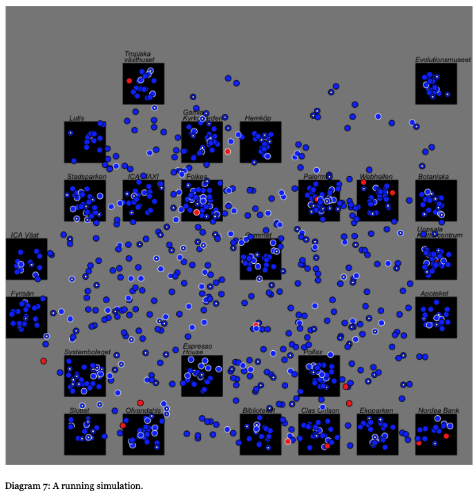

# Go Virus, Go!
This is a fun pandemic simulator that lets you determine the conditions under which the pandemic will run. You can change the infection rate, the number of people present, and many other factors, and observe the effects. 

## How to run:
Pull repo
Option 1:
Go to /src/ directory in terminal
Write 'go run main.go'
Option 2:
Go to /src/ directory in terminal
Write 'go build'
Run the generated executable, found in same directory.

## How to use tests
Navigate to correct folder -> clockwork\src\backend
In terminal write: go test
If you want to see coverage write: go test -coverage
If all tests pass: PASS will be printed
If at least one test fails: Error messages and FAIL will be printed
